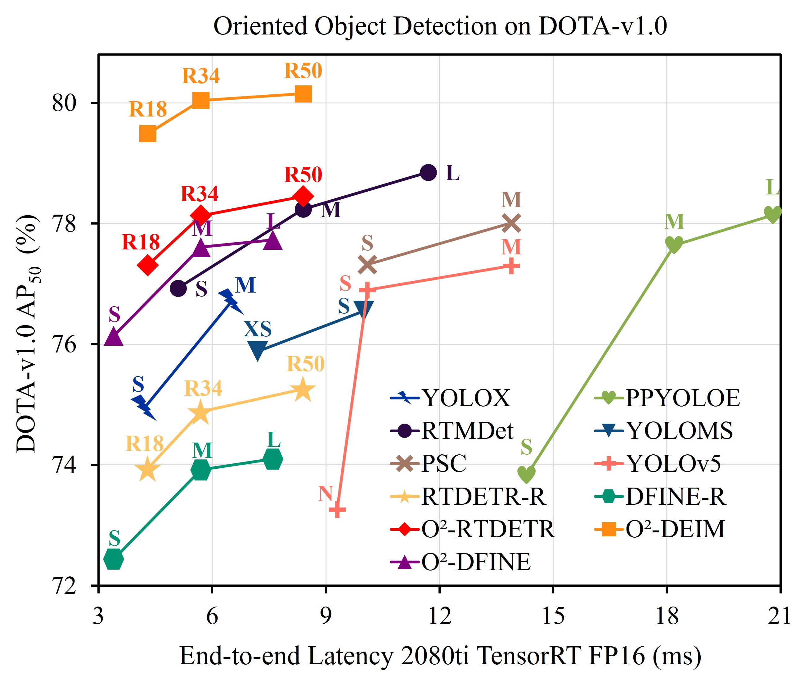
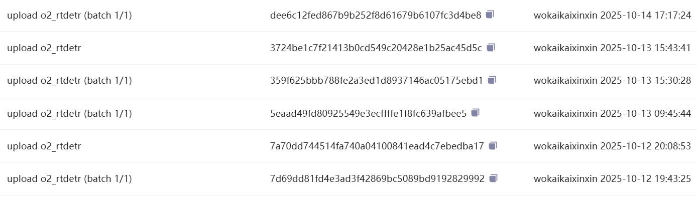

# Real-Time Oriented Object Detection Transformer in Remote Sensing Images (TGRS 2026)


[](https://github.com/wokaikaixinxin/O2-RT-DETR/stargazers)


[IEEE TGRS Xplore](https://ieeexplore.ieee.org/document/11424629)

[Arxiv](https://arxiv.org/abs/2603.15497)

Bilibili Install Tutorial:[](https://www.bilibili.com/video/BV1Ufw4zyEhR/)
Train Tutorial: [](https://www.bilibili.com/video/BV1QQw4zJEot/)
Test Tutorial: [](https://www.bilibili.com/video/BV1Vew8zbEVa/)
Deploy Tutorial: [](https://www.bilibili.com/video/BV1VmwLzWExY/)

## Abstract

Recent real-time detection transformers have gained popularity due to their simplicity and efficiency. However, these detectors do not explicitly model object rotation, especially in remote sensing imagery where objects appear at arbitrary angles, leading to challenges in angle representation, matching cost, and training stability. In this paper, **we propose a real-time oriented object detection transformer, the first real-time end-to-end oriented object detector to the best of our knowledge**, that addresses the above issues. Specifically, angle distribution refinement is proposed to reformulate angle regression as an iterative refinement of probability distributions, thereby capturing the uncertainty of object rotation and providing a more fine-grained angle representation. Then, we incorporate a Chamfer distance cost into bipartite matching, measuring box distance via vertex sets, enabling more accurate geometric alignment and eliminating ambiguous matches. Moreover, we propose oriented contrastive denoising to stabilize training and analyze four noise modes. We observe that a ground truth can be assigned to different index queries across different decoder layers, and analyze this issue using the proposed instability metric. We design a series of model variants and experiments to validate the proposed method.

Code is available at https://github.com/wokaikaixinxin/ai4rs/blob/main/projects/rotated_rtdetr/README.md

<div align="center">
  
</div>

---

**NOTE: O2-RTDETR is earlier than YOLO 26 !!!** We publicly released some of our methods on ModelScope as early as October 2025. The hash values are shown in the image below.

<div align="center">
  
</div>


# Bibtex

```bibtex
@ARTICLE{11424629,
  author={Ding, Zeyu and Zhou, Yong and Zhao, Jiaqi and Du, Wen-Liang and Li, Xixi and Yao, Rui and Saddik, Abdulmotaleb El},
  journal={IEEE Transactions on Geoscience and Remote Sensing}, 
  title={Real-Time Oriented Object Detection Transformer in Remote Sensing Images}, 
  year={2026},
  volume={64},
  number={5613014},
  pages={1-14},
  keywords={Real-time systems;Transformers;Detectors;Remote sensing;Costs;Training;Accuracy;YOLO;Uncertainty;Noise reduction;Detection transformer (DETR);oriented object detection;real-time detector;remote sensing},
  doi={10.1109/TGRS.2026.3671683}}
```